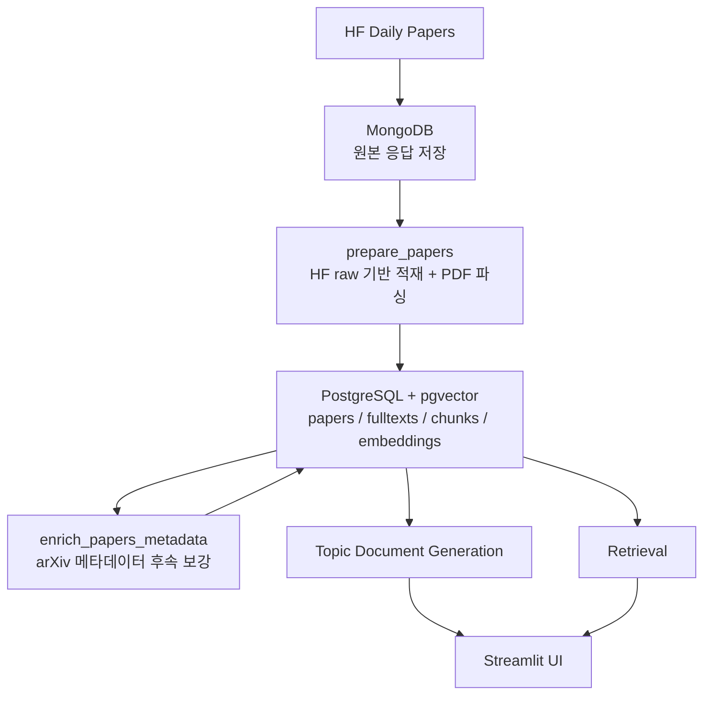

# ArXplore

ArXplore는 Hugging Face Daily Papers와 arXiv를 바탕으로 최신 AI 논문을 수집하고, 이를 한국어 토픽 문서와 RAG 기반 질의응답으로 탐색할 수 있게 만드는 AI 논문 탐색 플랫폼입니다.

## Features

- HF Daily Papers 기반 최신 논문 수집과 과거 raw 백필
- HF raw 기반 논문 적재와 arXiv 메타데이터 후속 보강
- PostgreSQL + pgvector 기반 논문 청크 저장 구조
- 토픽 문서 생성과 검색형 탐색을 위한 데이터 계약
- Streamlit 기반 검색/토픽 UI

## Architecture



## Stack

- Python
- MongoDB
- PostgreSQL + pgvector
- Airflow
- Streamlit
- LangChain
- LangSmith

## Quick Start

### Dev Container

```bash
bash scripts/setup-dev.sh
docker compose -p arxplore_dev -f docker-compose.dev.yml exec dev bash
streamlit run app/main.py --server.address=0.0.0.0
```

- Jupyter: `http://127.0.0.1:18888`
- Streamlit: `http://127.0.0.1:18501`

### Server Stack

```bash
bash scripts/setup-server.sh
docker compose -p arxplore_server -f docker-compose.server.yml ps
```

- Airflow: `http://localhost:18080`
- MongoDB: `localhost:17017`
- PostgreSQL: `localhost:15432`

### Local Parser

```bash
docker compose -f docker-compose.parser.yml up -d --build
docker logs -f arxplore-layout-parser
```

## Pipeline

1. `collect_papers`
   HF Daily Papers 원본을 수집해 MongoDB에 저장합니다.
2. `backfill_collect_papers`
   과거 HF Daily Papers 원본을 하루 최대 30일씩 순차 백필합니다.
3. `prepare_papers`
   로컬 GPU 워커에서 HF raw 기반 메타데이터와 PDF 파싱 결과를 PostgreSQL에 적재합니다.
4. `enrich_papers_metadata`
   저장된 논문에 arXiv 메타데이터를 후속 보강합니다.
5. `embed_papers`
   논문 청크 임베딩과 검색 고도화를 담당합니다.
6. `analyze_topics`
   토픽 문서를 생성하고 저장합니다.

## Project Structure

```text
app/                    Streamlit UI
dags/                   Airflow DAG 정의
docker/                 Docker 이미지와 실행 환경 설정
docs/                   아키텍처, 워크플로우, 역할 문서
notebooks/              점검 및 실험용 노트북
scripts/                개발 및 운영 보조 스크립트
src/core/               도메인 모델, 프롬프트, 체인
src/integrations/       외부 서비스 및 저장소 연동
src/pipeline/           파이프라인 실행 진입점
src/shared/             공통 설정과 tracing
```

## Documents

- [Architecture](./docs/ARCHITECTURE.md)
- [Workflow](./docs/WORKFLOW.md)
- [Roles](./docs/ROLES.md)
- [Team Setup](./docs/TEAM_SETUP.md)
- [Plan](./docs/PLAN.md)

## License

Internal project.
