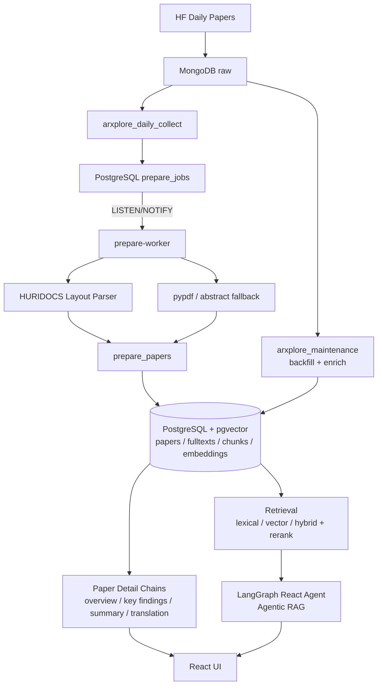

# ArXplore


ArXplore는 Hugging Face Daily Papers와 arXiv를 기반으로 최신 AI 논문을 수집하고, 이를 구조화된 논문 상세 문서와 LangGraph 기반 Agentic RAG로 재구성해 탐색할 수 있게 만드는 AI 논문 탐색 플랫폼입니다. 현재 시스템은 `서버 수집 자동화 + 로컬 prepare/embedding worker + PostgreSQL/pgvector 검색 계층 + LangGraph React Agent` 위에서 운영됩니다.

## Goals & Scope

ArXplore는 최신 AI 논문을 수집하고, 구조화된 논문 상세 문서와 RAG 기반 질의응답으로 재구성해 사용자가 더 빠르게 이해할 수 있도록 돕는 플랫폼입니다. `검색`, `논문 상세 탐색`, `한국어 요약`, `근거 기반 응답`을 한 제품 흐름으로 묶는 것을 목표로 합니다.

다루는 문제 영역:

- 최신 AI 논문이 빠르게 쏟아져 직접 골라 읽고 맥락을 연결하기 어려운 상황
- abstract만으로는 연구 흐름과 기여 차이를 충분히 파악하기 어려운 상황
- 영어 논문을 한국어로 빠르게 이해하고 다시 질문할 수 있는 도구가 부족한 상황
- 검색과 문서형 탐색이 분리돼 있어 사용 흐름이 끊기는 상황

서비스가 제공하는 두 가지 경험:

1. 사용자가 질문을 입력하면 관련 논문 청크를 검색해 근거 기반으로 답변하는 검색 중심 경험
2. 사용자가 질문 없이도 논문 목록과 상세 문서를 따라 최신 AI 연구 흐름을 읽는 탐색 중심 경험

### 도메인 범위

초기 범위는 최신 AI 연구 카테고리에 한정합니다.

- `cs.AI`
- `cs.CL`
- `cs.CV`
- `cs.LG`
- `cs.RO`
- 필요 시 `stat.ML`

범위 제한은 논문 상세 구성, retrieval, prompt, UI 전반의 품질을 안정화하기 위한 전략입니다.

### 핵심 사용자 경험

- **검색 중심 경험** — 메인 화면 상단의 자연어 질문 입력창에 질문을 넣으면 시스템이 관련 논문 청크를 검색한 뒤 근거 기반 답변을 생성하고, 답변과 함께 citation과 관련 논문을 표시합니다.
- **논문 목록 탐색 경험** — 질문 없이 메인 화면에 진입해도 HF-style 논문 목록만으로 현재 어떤 AI 연구가 올라오는지 파악할 수 있습니다.
- **논문 상세 경험** — 논문 상세 페이지는 overview(논문 개요), key findings(핵심 포인트), detailed summary(상세 요약 — 메인 본문), translation(근거 chunk 번역)을 최소 단위로 포함하는 구조화된 문서입니다.

## Features

- HF Daily Papers 기반 최신 논문 수집과 과거 raw backfill, arXiv 메타데이터 enrichment
- PostgreSQL `prepare_jobs` 기반 prepare queue와 `LISTEN/NOTIFY` 로컬 `prepare-worker`
- HURIDOCS Layout Parser 우선, `pypdf` → abstract fallback 기반 PDF 파싱
- PostgreSQL + pgvector 기반 fulltext, chunk, embedding 적재
- lexical / vector / hybrid retrieval 및 rerank 파이프라인
- 논문 overview / key findings / detailed summary / translation 생성 chain
- 논문 분석/요약 결과를 PostgreSQL `paper_ai_overviews`, `paper_ai_detailed_summaries`에 캐싱해 재방문 시 재생성 비용 제거
- 논문 상세 페이지의 관련 논문 카드 (로컬 DB 검색 + arXiv 외부 검색 결합)
- LangGraph React Agent 기반 Agentic RAG 챗봇 (도구 호출, SSE 기반 스트리밍 응답, 사용자측 중지 버튼)
- React 기반 검색, 카드 그리드, 상세 문서, 에이전트 채팅 UI

## System Architecture



서버 Airflow는 수집 자동화와 큐 등록만 담당하고, 무거운 파싱과 임베딩은 로컬 worker가 처리합니다. raw payload는 MongoDB가 source of truth, 정제 데이터와 vector index는 PostgreSQL + pgvector가 담당해 retrieval, 상세 문서 생성, Agentic RAG의 공용 데이터 계층을 구성합니다. 자세한 내용은 [Architecture](./docs/architecture/ARCHITECTURE.md) 문서를 참고하세요.

## Tech Stack

- **Language** Python
- **Storage** MongoDB (raw), PostgreSQL + pgvector (정제 / queue / vector)
- **Orchestration** Airflow
- **Parser** HURIDOCS PDF Document Layout Analysis, pypdf
- **LLM / RAG** LangChain, LangGraph (React Agent), LangSmith
- **UI** React + Django
- **Runtime** Demo: nginx + gunicorn, Frontend edit: Vite

## Data Collection & Preprocessing

수집과 전처리는 `서버 수집 → raw 보존 → 로컬 prepare/embedding` 흐름으로 분리되어 있습니다.

- **수집 소스** HF Daily Papers API (최신 논문 + 메타데이터), arXiv API (제목/초록/저자 보강)
- **Raw 저장** MongoDB에 날짜별 원본 payload와 backfill 상태를 그대로 저장 (재처리 가능)
- **PDF 파싱** HURIDOCS Layout Parser → `pypdf` → abstract fallback 순으로 시도하여 항상 본문을 확보
- **Section 정리** 파서 출력에서 헤더/본문/참고문헌을 분리하고 `content_role`과 `section_title`을 부여
- **Chunking** section 경계를 보존한 토큰 기반 분할, quality metrics와 parser metadata 동시 기록
- **Embedding** 청크 단위 임베딩 생성 후 `paper_embeddings`에 적재 (pgvector index)
- **Job Queue** PostgreSQL `prepare_jobs`로 `enqueue → claim → retry → done` 상태를 관리, 로컬 worker는 `LISTEN/NOTIFY`로 새 작업을 즉시 소비

자세한 데이터 흐름과 저장 구조는 [Architecture](./docs/architecture/ARCHITECTURE.md)의 "데이터 흐름"과 "저장 구조" 절에 정리되어 있습니다.

## Software: RAG with LLM × Vector DB

LLM과 벡터 데이터베이스를 연결하는 RAG 구현 코드는 다음 위치에 있습니다.

- [src/integrations/vector_repository.py](src/integrations/vector_repository.py) — pgvector 적재 및 vector retrieval
- [src/integrations/paper_repository.py](src/integrations/paper_repository.py) — `papers / paper_fulltexts / paper_chunks` 적재와 lexical retrieval
- [src/integrations/paper_retriever.py](src/integrations/paper_retriever.py) — lexical / vector / hybrid retrieval 인터페이스
- [src/integrations/embedding_client.py](src/integrations/embedding_client.py) — 임베딩 생성 클라이언트
- [src/integrations/fulltext_parser.py](src/integrations/fulltext_parser.py) — layout / pypdf / fallback 파싱과 chunk 보정
- [src/integrations/paper_search.py](src/integrations/paper_search.py) — HF Daily Papers 및 arXiv 메타데이터 조회, 관련 논문 외부 검색
- [src/pipeline/embed_papers.py](src/pipeline/embed_papers.py) — 청크 임베딩 파이프라인
- [src/pipeline/prepare_worker.py](src/pipeline/prepare_worker.py) — prepare queue 소비 worker
- [src/core/rag.py](src/core/rag.py) — retrieval 결과를 answer로 합성하는 RAG 응답 계층
- [src/core/paper_chains.py](src/core/paper_chains.py) — 논문 overview / key findings 생성 체인
- [src/core/translation_chains.py](src/core/translation_chains.py) — detailed summary / translation 체인
- [src/core/prompts/](src/core/prompts/) — overview / key findings / summary / translation 프롬프트
- [backend/papers/services.py](backend/papers/services.py) — LLM 체인 호출, AI 요약 캐싱, 로컬 + 외부 검색을 결합한 관련 논문 합성

### Agentic RAG (LangGraph React Agent)

단순 프롬프트 기반 QA를 넘어, LangGraph React Agent로 도구 호출 기반의 다단계 추론을 수행합니다.

- **Agent Node** 사용자 메시지와 대화 컨텍스트를 보고 호출할 도구를 결정
- **Tools Node**
  - `search_paper_chunks_tool` — 키워드 기반 본문 청크 근거 검색
  - `get_trending_papers_tool` — 최신/인기 논문 통계 조회
- **Conditional Edges** 도구 호출이 필요할 때마다 agent ↔ tools 사이를 반복 (React 패턴)
- **Streaming** `stream_mode="messages"`로 실시간 타이핑 응답을 React UI에 전달

## Test Plan & Results

테스트 및 점검은 단위 검증, 데이터 적재 확인, retrieval 품질 점검, end-to-end UI 검증을 함께 운영합니다.

### Test Plan

| 영역 | 대상 | 방법 |
| --- | --- | --- |
| 수집 | `arxplore_daily_collect`, `arxplore_maintenance` | Airflow DAG 수동 trigger 후 MongoDB raw 적재 확인 |
| Prepare Queue | `prepare_jobs` enqueue / claim / retry | `LISTEN/NOTIFY` 트리거 및 stale reset 시나리오 검증 |
| PDF 파싱 | HURIDOCS / pypdf / abstract fallback | 파서 실패 케이스 강제 주입 후 fallback 경로 점검 |
| 적재 | `papers / paper_fulltexts / paper_chunks / paper_embeddings` | [notebooks/retrieval_inspection.ipynb](notebooks/retrieval_inspection.ipynb) 로 적재 상태 확인 |
| Retrieval | lexical / vector / hybrid + rerank | 동일 질의에 대한 채널별 결과 비교, section/role rerank 효과 확인 |
| 생성 | overview / key findings / summary / translation | 샘플 논문에 대해 chain 출력 품질을 LangSmith trace로 검증 |
| Agentic RAG | LangGraph React Agent | 다중 도구 호출 시나리오와 스트리밍 응답 동작 검증 |
| UI | React pages | 논문 리스트 / 상세 / 에이전트 채팅 페이지 수동 회귀 |

### LangSmith Trace Stages

운영 중 추적되는 핵심 stage는 다음과 같습니다.

`collect_papers`, `backfill_collect_papers`, `prepare_papers`, `consume_prepare_queue`, `embed_papers`, `enrich_papers_metadata`, `analyze_paper_detail`, `paper_overview`, `paper_key_findings`, `translation`, `summary`, `rag_answer`

### Results

- HF Daily Papers 일일 수집 → prepare → embed 파이프라인이 자동화 상태로 운영되며, 신규 논문이 동일 일자 내에 검색/상세 문서/Agent 응답에 반영됨
- HURIDOCS 우선 + fallback 구조로 파싱 실패 시에도 본문 또는 abstract 기반 chunk가 항상 확보되어 retrieval 누락 없음
- lexical / vector / hybrid 결과를 동일 쿼리에서 비교하여 hybrid + rerank 조합이 grounding 품질에서 우위를 보임을 확인
- LangGraph React Agent가 도구 호출과 스트리밍 응답을 안정적으로 수행, React UI에서 실시간 타이핑으로 노출됨

상세한 점검 절차와 노트북은 [notebooks/](notebooks/) 와 [docs/management/WORKFLOW.md](docs/management/WORKFLOW.md) 를 참고하세요.

## Quick Start

### 실행

```bash
bash scripts/setup.sh
```

| 서비스 | URL | 설명 |
|--------|-----|------|
| Web | `http://localhost:80` | nginx → gunicorn Django + React 빌드 |
| Vite | `http://localhost:5173` | 프론트엔드 수정 실시간 확인 |

```bash
# 내리기
docker compose down
```

### Parser + Prepare Worker (GPU 필요)

PDF 파싱과 임베딩 처리가 필요할 때 `parser` 프로필로 추가 실행합니다.

```bash
docker compose --profile parser up -d --build
```

- `arxplore-layout-parser` — HURIDOCS GPU 파서 (`:5060`)
- `arxplore-prepare-worker` — prepare queue 소비 worker (LISTEN/NOTIFY 루프)

### 서버 포트 포워딩

메인 서버(PostgreSQL · MongoDB · Airflow)로 SSH 터널이 필요할 때 사용합니다.

```bash
bash scripts/setup.sh forward            # 시작
bash scripts/setup.sh forward stop       # 중지
bash scripts/setup.sh forward status     # 상태 확인
bash scripts/setup.sh forward restart    # 재시작
```

### Server Stack

메인 서버 컴퓨터에서만 실행합니다.

```bash
bash scripts/setup-server.sh
docker compose -p arxplore_server -f docker-compose.server.yml ps
```

- Airflow: `http://127.0.0.1:18080`
- MongoDB: `localhost:17017`
- PostgreSQL: `localhost:15432`

운영 중인 Airflow DAG:

- `arxplore_daily_collect` — KST 18:00, HF Daily Papers 수집 후 `prepare_jobs` enqueue
- `arxplore_maintenance` — 3시간마다 raw backfill → arXiv 메타데이터 enrichment

시연 실행 전 `.env`에는 `DJANGO_SECRET_KEY`와 `PROD_POSTGRES_HOST`를 실제 값으로 설정해야 합니다. 80번 포트가 이미 사용 중이면 `PROD_HTTP_PORT=18000`처럼 포트를 바꿔 실행합니다.

## Project Structure

```text
dags/                   Airflow DAG 정의 (daily_collect, maintenance)
docker/                 Docker 이미지 및 런타임 설정
docs/                   아키텍처, 워크플로우, 역할, 운영 문서
frontend/               React 프론트엔드 (Vite + TypeScript)
notebooks/              점검 및 실험용 노트북
scripts/                개발 및 운영 보조 스크립트
src/core/               도메인 모델, 프롬프트, chains, RAG, agent
src/integrations/       외부 연동, 저장소, parser, retrieval 구현
src/pipeline/           파이프라인 진입점과 prepare-worker
src/shared/             공통 설정과 tracing
backend/                Django API + React shell
```

## Documents

- [Architecture](./docs/architecture/ARCHITECTURE.md)
- [AI Rules](./docs/architecture/AGENTS.md)
- [Workflow](./docs/management/WORKFLOW.md)
- [Roles](./docs/management/ROLES.md)
- [Team Setup](./docs/management/TEAM_SETUP.md)

## License

Internal project
