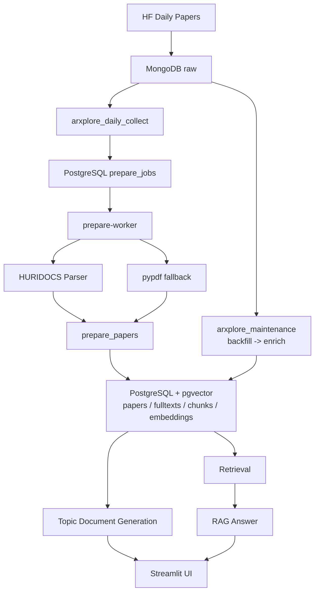

# ArXplore

ArXplore는 Hugging Face Daily Papers와 arXiv를 기반으로 최신 AI 논문을 수집하고, 이를 구조화된 topic document와 RAG 기반 질의응답으로 재구성해 탐색할 수 있게 만드는 AI 논문 탐색 플랫폼입니다. 현재 구조는 `서버 수집 자동화 + 로컬 prepare/embedding worker + PostgreSQL/pgvector 검색 계층`을 기준으로 운영됩니다.

## Features

- HF Daily Papers 기반 최신 논문 수집과 과거 raw backfill
- PostgreSQL `prepare_jobs` 기반 prepare queue와 로컬 `prepare-worker`
- HURIDOCS 우선, `pypdf` fallback 기반 PDF 파싱
- PostgreSQL + pgvector 기반 fulltext, chunk, embedding 적재
- lexical / vector / hybrid retrieval 기본 구조
- `TopicDocument` 생성과 RAG 응답을 위한 공용 데이터 계약
- Streamlit 기반 검색, 카드, 상세 문서 UI

## Architecture



## Stack

- Python
- MongoDB
- PostgreSQL + pgvector
- Airflow
- Streamlit
- LangChain
- LangSmith
- HURIDOCS PDF Document Layout Analysis

## Quick Start

### Dev Container

```bash
bash scripts/setup-dev.sh
docker compose -p arxplore_dev -f docker-compose.dev.yml exec dev bash
streamlit run app/main.py --server.address=0.0.0.0
```

- Jupyter: `http://127.0.0.1:18888`
- Streamlit: `http://127.0.0.1:18501`

### Local Parser

```bash
docker compose -f docker-compose.parser.yml up -d --build
docker logs -f arxplore-layout-parser
```

### Prepare Worker

```bash
bash scripts/prepare-worker.sh
```

1회만 실행하려면:

```bash
bash scripts/prepare-worker.sh once
```

### Server Stack

```bash
bash scripts/setup-server.sh
docker compose -p arxplore_server -f docker-compose.server.yml ps
```

현재 주요 Airflow DAG:

- `arxplore_daily_collect`
- `arxplore_maintenance`

## Pipeline

1. `arxplore_daily_collect`
   최신 HF Daily Papers raw를 수집하고 `prepare_jobs`에 prepare 작업을 등록합니다.
2. `arxplore_maintenance`
   과거 raw backfill과 arXiv metadata enrichment를 수행합니다.
3. `prepare-worker`
   로컬 runtime에서 `prepare_jobs`를 소비해 `prepare -> embed`를 수행하고 결과를 PostgreSQL에 적재합니다.
4. `retrieval`
   저장된 chunk와 embedding을 바탕으로 lexical, vector, hybrid 검색을 수행합니다.
5. `topic document / RAG answer`
   검색 결과와 논문 묶음을 기반으로 문서와 응답을 생성합니다.

## Project Structure

```text
app/                    Streamlit 전역 라우터 (main.py)
app/views/              페이지 뷰 (list, detail, agent_chat)
app/components/         공통 UI 요소 및 이동 로직
dags/                   Airflow DAG 정의
docker/                 Docker 이미지와 실행 환경 설정
docs/                   아키텍처, 워크플로우, 역할, 운영 문서
notebooks/              점검 및 실험용 노트북
scripts/                개발 및 운영 보조 스크립트
src/core/               도메인 모델, 프롬프트, 체인, RAG 응답
src/integrations/       외부 서비스 및 저장소 연동, retrieval 구현
src/pipeline/           파이프라인 실행 진입점과 worker
src/shared/             공통 설정과 tracing
```

## Documents

## Documents

- [Architecture](./docs/architecture/ARCHITECTURE.md)
- [AI Rules](./docs/architecture/AGENTS.md)
- [Plan](./docs/management/PLAN.md)
- [Workflow](./docs/management/WORKFLOW.md)
- [Roles](./docs/management/ROLES.md)
- [Team Setup](./docs/management/TEAM_SETUP.md)

## License

Internal project
