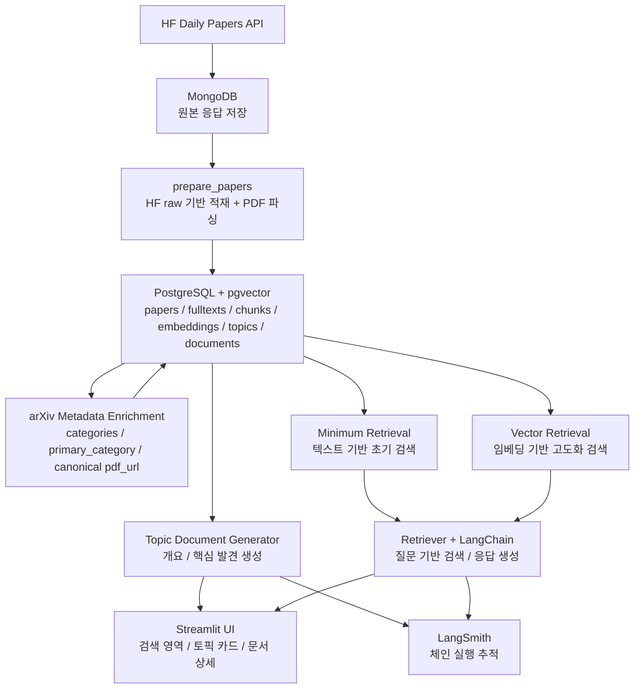
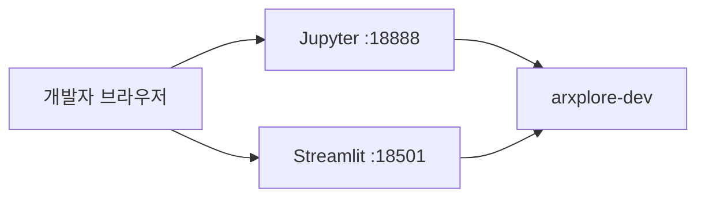
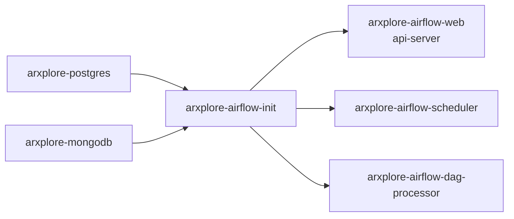
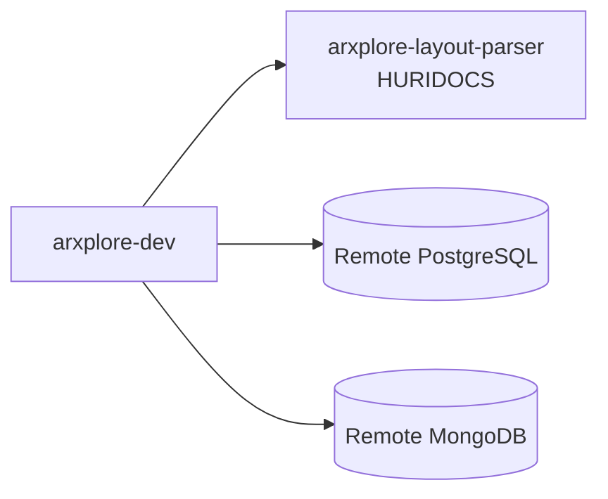
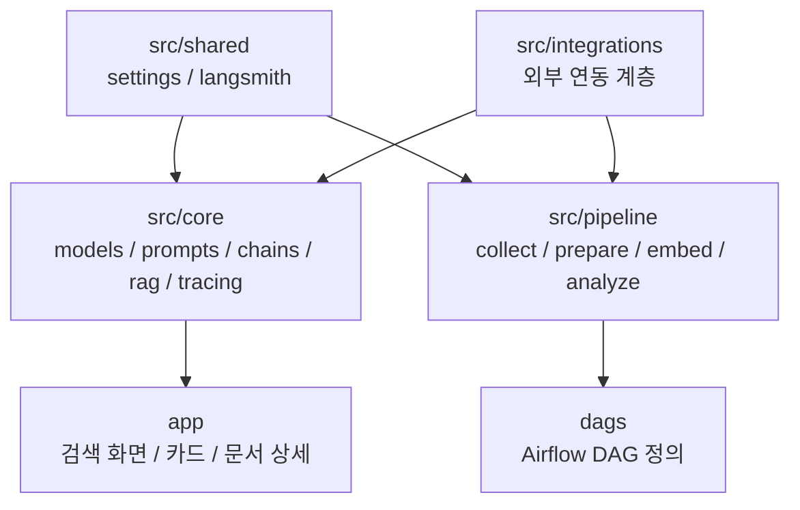

# ArXplore 시스템 아키텍처

## 1. 문서 목적

이 문서는 ArXplore의 목표 구조와 현재 초안 구조를 함께 설명한다. RAG 기반 검색, 토픽 카드 탐색, 토픽 문서 상세 화면이 어떤 계층 위에서 연결되는지 정리하고, 5인 팀이 병렬로 작업할 때 어느 모듈이 어떤 책임을 맡는지도 함께 정리한다.

## 2. 시스템 전경

전체 시스템은 "AI 논문 수집 → raw 저장 → PDF 본문 텍스트 파싱과 청크 적재 → arXiv 메타데이터 후속 보강 → 임베딩 및 토픽 구성 → 토픽 문서 생성 → RAG 검색 및 UI 렌더링"의 흐름으로 구성된다.



HF Daily Papers에서 수집한 결과는 먼저 MongoDB에 원본 그대로 저장한다. 이후 `prepare_papers`는 HF raw 기반 최소 메타데이터와 PDF 파싱 결과를 바탕으로 PostgreSQL과 pgvector에 구조화된 데이터를 적재한다. arXiv API 보강은 별도 `enrich_papers_metadata` 경로로 분리해, 서버에서 천천히 후속 갱신하는 구조를 사용한다. 이 데이터는 두 방향으로 사용된다. 첫째는 토픽별 문서를 생성하는 문서 생성 흐름이고, 둘째는 사용자 질문에 대응하는 retrieval + LangChain 기반 RAG 흐름이다. 최종적으로 Streamlit UI는 상단 검색 영역, 하단 토픽 카드 영역, 토픽 문서 상세 화면을 하나의 제품 흐름으로 묶는다.

ArXplore는 표와 그림 중심 분석보다 텍스트 기반 탐색 경험을 우선한다. 다만 현재 `prepare_papers` 구현은 HURIDOCS 레이아웃 파서를 앞단에 붙여 `Table`, `Picture`, `Caption` 같은 artifact 메타데이터를 함께 수집한다. 이 artifact는 아직 retrieval 주 입력으로 쓰지 않지만, `paper_fulltexts.artifacts`와 `parser_metadata`에 저장해 후속 품질 개선과 디버깅에 활용할 수 있게 설계했다.

## 3. 목표 사용자 흐름

### 3-1. 검색 중심 흐름

사용자가 메인 화면 상단 검색창에 질문을 입력하면, 시스템은 논문 청크와 토픽 문서를 검색한다. 검색 결과는 LangChain 체인으로 전달되고, LLM은 검색된 범위 안에서 답변을 생성한다. 답변 아래에는 근거 논문과 관련 토픽을 함께 표시한다.

### 3-2. 탐색 중심 흐름

사용자가 질문 없이 메인 화면에 진입해도, 하단 카드 섹션을 통해 주요 토픽을 훑어볼 수 있어야 한다. 이 카드들은 저장된 `TopicDocument`를 바탕으로 구성되며, 제목과 짧은 설명을 통해 현재 AI 연구 지형을 빠르게 파악할 수 있도록 한다.

### 3-3. 문서 탐색 흐름

사용자가 카드를 선택하면 토픽 문서 상세 화면으로 이동한다. 상세 화면은 단순 본문이 아니라 `개요`, `핵심 발견`, `논문 목록`, `관련 토픽`을 구조적으로 제공해야 하며, 여기에 목차와 탐색 연결을 더해 주제 탐색을 확장할 수 있어야 한다.

## 4. 런타임 토폴로지

현재 저장소는 개발 환경과 서버 환경을 분리한다.

### 개발 환경

개발 환경은 `docker-compose.dev.yml`을 기준으로 동작하며, 단일 `dev` 컨테이너를 제공한다. 이 컨테이너는 Jupyter, Python 실행, Streamlit 수동 실행을 담당한다.



### 서버 환경

서버 환경은 `docker-compose.server.yml`을 기준으로 동작하며, Airflow 3 권장 구성에 맞춰 역할을 분리한다.



각 서비스의 역할은 다음과 같다.

- `arxplore-postgres`: Airflow 메타데이터와 애플리케이션 관계형 데이터를 저장한다.
- `arxplore-mongodb`: HF Daily Papers 원본 응답과 수집 상태 메타데이터를 저장한다.
- `arxplore-airflow-init`: Airflow 메타데이터 데이터베이스를 초기화하는 1회성 컨테이너이다.
- `arxplore-airflow-web`: Airflow UI와 API 엔드포인트를 제공한다.
- `arxplore-airflow-scheduler`: 스케줄과 태스크 실행을 관리한다.
- `arxplore-airflow-dag-processor`: DAG 파일을 파싱하고 등록 가능한 형태로 직렬화한다.

현재 초안 기준에서 이 구성이 실제로 기동되고, 6개의 DAG가 등록되는 상태까지 준비되어 있다. 다만 PDF 파싱용 HURIDOCS 컨테이너는 서버 스택 기본 구성에 포함하지 않는다. 서버는 MongoDB, PostgreSQL, Airflow 중심으로 유지하고, parser는 개발용 PC에서 별도 `docker-compose.parser.yml`로 띄우는 운영 모델을 현재 기준으로 사용한다.

### 로컬 parser 환경

PDF 파싱 품질 검증과 `prepare_papers` 수동 실행은 로컬 parser 컨테이너를 함께 띄우는 것을 기준으로 한다.



이 토폴로지에서는 PDF 다운로드, 레이아웃 분석, `pypdf` fallback, 청크 생성이 개발용 PC의 CPU/GPU를 사용하고, MongoDB와 PostgreSQL은 기존 서버에 그대로 적재된다. 즉 MongoDB raw는 source of truth이고, PostgreSQL 정제층은 재생성 가능한 캐시 계층으로 취급할 수 있다.

## 5. 코드베이스 모듈 구조

프로젝트의 핵심 모듈 관계는 다음과 같다.



### `src/shared`

`src/shared`는 프로젝트 전반에서 공통으로 사용하는 기반 기능을 제공한다. 현재는 `settings.py`를 통해 환경 변수를 로딩하고, `langsmith.py`를 통해 LangSmith 환경 설정 및 trace metadata 구성을 담당한다. 이 계층은 특정 도메인 로직을 담지 않고, 다른 계층이 동일한 방식으로 설정과 추적 기능을 사용할 수 있도록 하는 공용 기반 계층이다.

### `src/core`

`src/core`는 ArXplore의 도메인 중심 계층이다. `models.py`는 `TopicDocument`, `PaperRef`, `RelatedTopic` 계약을 정의하고, `prompts/`는 개요와 핵심 발견 생성용 프롬프트를 분리해 관리한다. `chains.py`는 논문 목록을 받아 각 섹션을 생성하고 최종 `TopicDocument`를 조합하는 문서 생성 진입점 역할을 수행한다. `rag.py`는 최소 retrieval 또는 vector retrieval 결과를 바탕으로 답변, 근거 논문, 관련 토픽을 조합하는 RAG 응답 진입점이다. `tracing.py`는 문서 생성과 검색 응답 trace 설정을 조합한다.

이 계층은 현재 문서 생성과 RAG 응답의 경계를 함께 잡아 둔 상태이며, 실제 구현은 이후 역할 분담에 따라 확장한다.

### `src/pipeline`

`src/pipeline`은 Airflow DAG가 호출하는 실행 진입점 계층이다. `collect_papers.py`, `prepare_papers.py`, `embed_papers.py`, `analyze_topics.py`는 물론, 과거 raw를 누적하는 `backfill_collect_papers`와 저장된 논문 메타를 후속 보강하는 `enrich_papers_metadata` 경로까지 이 계층에서 관리한다. 이 중 `prepare_papers.py`는 더 이상 스캐폴드가 아니라 실제 전처리 로직을 수행한다. raw payload 로드, arXiv ID 추출, HF raw 기반 최소 메타데이터 정리, PDF 파싱, chunk 생성, PostgreSQL 적재까지 이 계층에서 처리한다. arXiv 메타데이터 보강은 `enrich_papers_metadata.py`가 따로 담당한다. 반면 `embed_papers.py`와 `analyze_topics.py`는 아직 최소 반환 구조 중심으로 남아 있다.

### `dags`

`dags`는 Airflow가 파싱하는 DAG 정의 파일 위치이다. DAG 파일은 가능한 한 가볍게 유지하고, 실제 작업은 `src/pipeline` 함수 호출로 위임하는 방식을 기본 원칙으로 한다. Airflow가 DAG 파일을 반복적으로 파싱하므로, 무거운 비즈니스 로직은 DAG 정의 파일에 직접 넣지 않는다.

### `app`

`app`은 Streamlit UI 계층이다. 목표 구조에서 `main.py`는 검색 영역과 카드 리스트의 진입점을 담당하고, `components/`는 카드 및 문서 섹션 렌더링을 담당하며, `pages/topic_detail.py`는 토픽 문서 상세 화면을 담당한다. 현재는 데모 데이터를 사용하지만, 장기적으로는 저장된 `TopicDocument`와 검색 결과를 읽는 읽기 전용 프런트 계층이 된다.

### `src/integrations`

`src/integrations`는 외부 서비스 연동 계층이다. `paper_search.py`, `raw_store.py`, `paper_repository.py`, `topic_repository.py`, `embedding_client.py`, `vector_repository.py`를 기준으로 역할별 구현을 시작하도록 구성되어 있다. 여기에 현재는 `fulltext_parser.py`와 `layout_parser_client.py`가 실제 PDF 파싱 경로를 담당한다. `LayoutParserClient`는 HURIDOCS `POST /` JSON 응답을 검증하고, `FulltextParser`는 `layout_pdf -> pypdf -> fallback_abstract` 순서로 파싱을 시도하며 section 정리, heading 보정, chunk 품질 보정까지 담당한다. 현재 운영 기준에서는 1번 역할이 쓰기 경로와 최소 retrieval 준비를 주도하고, 2번 역할이 임베딩과 vector retrieval 고도화를 담당한다.

## 6. 데이터 흐름

데이터는 아래 순서로 이동한다.

1. HF Daily Papers에서 날짜별 논문 목록을 수집한다.
2. 최신 수집 경로와 별도로 backfill DAG가 과거 날짜를 하루 최대 30일씩 MongoDB에 채운다.
3. 원본 응답을 MongoDB에 저장한다.
4. `prepare_papers`가 HF raw 기반 최소 메타데이터를 정리한다.
5. PDF 본문 텍스트와 섹션 정보를 파싱한다.
6. 가능하면 HURIDOCS 레이아웃 파서를 먼저 사용하고, 실패 시 `pypdf`로 fallback한다.
7. 파싱 결과에서 본문 텍스트, 섹션, 품질 메트릭, artifact 메타데이터를 만든다.
8. 정제된 논문, 본문 텍스트, 청크를 PostgreSQL에 저장한다.
9. `enrich_papers_metadata`가 저장된 논문에 arXiv 메타데이터를 후속 보강한다.
10. 최소 retrieval이 청크 기반 검색 경로를 제공한다.
11. 임베딩을 생성하고 벡터 검색 가능한 형태로 저장한다.
12. 유사 논문들을 토픽 단위로 묶는다.
13. 토픽별 논문 묶음을 기준으로 `개요`, `핵심 발견`을 생성한다.
14. 논문 메타데이터와 관련 토픽 메타데이터를 결정적으로 조합한다.
15. 최종 `TopicDocument`를 저장한다.
16. 사용자 질문이 들어오면 먼저 최소 retrieval 또는 최종 vector retrieval을 통해 논문 청크와 토픽 문서를 검색한다.
17. 검색 결과를 바탕으로 답변을 생성하고 근거 논문과 함께 UI에 노출한다.

이 흐름은 현재 저장소 기준에서 실행 순서와 책임 위치가 비교적 명확하게 분리된 상태이다. `collect_papers`, `backfill_collect_papers`, `prepare_papers`, `enrich_papers_metadata`는 실제 동작 경로를 갖고 있고, `embed_papers`, `analyze_topics`, 최종 retrieval 고도화는 이후 구현 단계에서 채운다.

## 7. 저장 구조

### MongoDB

MongoDB는 HF Daily Papers 원본 응답을 유연하게 저장하는 용도로 사용한다. 각 문서는 수집 날짜, payload 전체, 수집 시각 필드와 함께 저장되며, 원본 보존을 통해 전처리 로직 변경 시 재처리를 가능하게 한다.

### PostgreSQL + pgvector

PostgreSQL은 정제된 논문과 관계형 메타데이터를 저장하고, pgvector는 유사도 검색을 담당한다. 목표 테이블 구성은 다음과 같다.

- `papers`
- `paper_fulltexts`
- `paper_chunks`
- `paper_embeddings`
- `topics`
- `topic_documents`

`paper_fulltexts`는 PDF에서 추출한 본문 텍스트와 섹션 정보에 더해 `quality_metrics`, `artifacts`, `parser_metadata`를 저장한다. `paper_chunks`와 `paper_embeddings`는 RAG 검색에 직접 사용되고, 현재 chunk role은 `body`, `front_matter`, `references` 중심으로 유지한다. `topics`와 `topic_documents`는 카드 UI와 문서 상세 화면의 핵심 입력이 된다.

## 8. `TopicDocument` 계약

프로젝트 전체에서 가장 중요한 데이터 계약은 `TopicDocument`이다. 이 계약은 LLM 체인의 최종 출력이자, 저장 계층의 입력이며, UI 렌더링의 입력이다.

```python
class PaperRef(BaseModel):
    arxiv_id: str
    title: str
    authors: list[str]
    abstract: str
    pdf_url: str
    published_at: datetime | None = None
    upvotes: int = 0
    github_url: str | None = None
    github_stars: int | None = None
    citation_count: int | None = None

class RelatedTopic(BaseModel):
    topic_id: int
    title: str

class TopicDocument(BaseModel):
    topic_id: int
    title: str
    overview: str
    key_findings: list[str]
    papers: list[PaperRef]
    related_topics: list[RelatedTopic]
    generated_at: datetime
```

이 계약을 유지하면 저장 계층, LLM 계층, UI 계층을 병렬로 개발하더라도 최종 통합 비용을 줄일 수 있다. 팀원들은 가능한 한 이 계약을 먼저 확정하고, 각자 자신의 계층에서 이 계약을 입력 또는 출력으로 맞추는 방식으로 개발해야 한다.

## 9. LangSmith 추적

LangSmith는 LLM 체인과 파이프라인 단계를 추적하는 용도로 사용한다. 현재 기준 trace stage는 다음 여섯 가지이다.

- `stage=collect_papers`: 논문 수집
- `stage=backfill_collect_papers`: 과거 raw 백필 수집
- `stage=prepare_papers`: 논문 전처리
- `stage=enrich_papers_metadata`: 저장된 논문의 arXiv 메타데이터 후속 보강
- `stage=embed_papers`: 임베딩 및 토픽 묶기
- `stage=analyze_topics`: 토픽 문서 생성

현재 구조에서는 특히 `analyze_topics` 단계의 품질과 이후 RAG 응답 품질이 중요하다. 따라서 프롬프트 수정, 입력 논문 샘플 변경, 생성 결과의 안정성 검토는 모두 LangSmith trace를 기준으로 비교하는 것을 기본 운영 원칙으로 한다.
