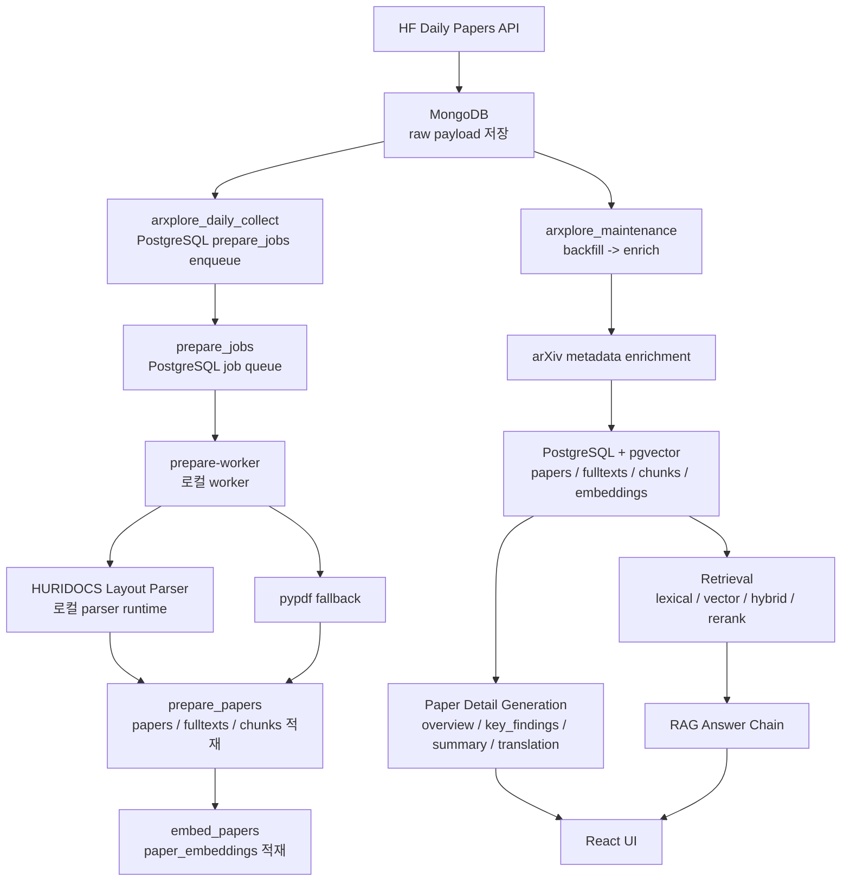
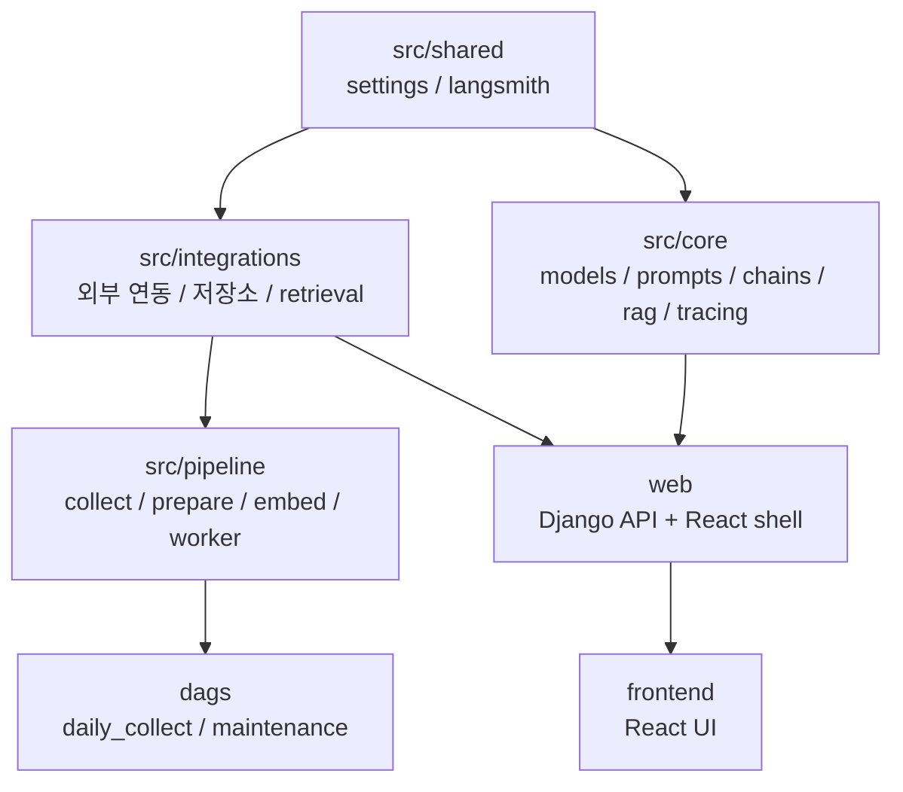

# ArXplore 시스템 아키텍처

## 1. 문서 목적

이 문서는 ArXplore의 현재 운영 구조와 모듈 경계를 코드 기준으로 설명한다. 목표 구조를 추상적으로 제시하는 것이 아니라, 이미 구현된 수집, 파싱, 적재, 임베딩 기반 위에 retrieval, answer chain, 논문 상세 문서, UI가 어떤 식으로 연결되는지를 정리하는 데 목적이 있다.

현재 ArXplore는 `최신 AI 논문 수집 -> raw 저장 -> prepare queue 등록 -> 로컬 prepare/embedding -> retrieval -> 논문 상세 문서 / RAG answer -> UI` 흐름을 기준으로 한다. 이때 수집 자동화와 무거운 파싱/임베딩 실행은 같은 런타임에 있지 않다. 서버 스택은 Airflow와 데이터 저장소를 운영하고, 로컬 개발용 PC는 React/Django 개발 서버, parser, prepare worker를 실행하는 역할을 맡는다.

## 2. 시스템 전경

전체 시스템은 아래 흐름으로 동작한다.



이 그림에서 중요한 점은 다음 두 가지다.

- 수집 자동화는 서버 Airflow가 수행한다
- prepare와 embed는 로컬 worker가 수행하고, 결과는 서버 DB에 직접 적재한다

즉 현재 시스템은 "서버가 큐를 만든 뒤 로컬 worker가 이를 소비하는 분리형 구조"다. 이 구조는 로컬 GPU와 parser 컨테이너를 활용하면서도, 서버 DB를 공용 저장소로 유지하기 위해 채택됐다.

## 3. 핵심 런타임 토폴로지

### 서버 런타임

서버 스택은 `docker-compose.server.yml`을 기준으로 동작하며 아래 컨테이너를 포함한다.

- `arxplore-postgres`
- `arxplore-mongodb`
- `arxplore-airflow-init`
- `arxplore-airflow-web`
- `arxplore-airflow-scheduler`
- `arxplore-airflow-dag-processor`

서버 Airflow는 현재 2개의 DAG를 운영한다.

- `arxplore_daily_collect`
  - 매일 KST 18:00에 최신 HF Daily Papers raw를 수집한다
  - 수집 날짜를 PostgreSQL `prepare_jobs`에 enqueue한다
- `arxplore_maintenance`
  - 3시간마다 `backfill -> enrich`를 수행한다
  - backfill 실패 시에도 enrich는 계속 수행하도록 설계한다

### 로컬 개발 런타임

최종 시연 환경은 단일 `docker-compose.yml` 기본 서비스인 `arxplore-nginx`, `arxplore-django`, `arxplore-vite`를 중심으로 동작한다. nginx는 React build 정적 파일을 서빙하고 API 요청을 Django로 프록시하며, Django는 gunicorn으로 백엔드 API를 실행한다. `arxplore-vite`는 프론트엔드 수정 화면을 그대로 띄우는 Vite dev server이며 기본 실행에 포함된다.

### 로컬 parser 런타임

PDF 파싱은 같은 `docker-compose.yml`의 `parser` 프로필 서비스인 HURIDOCS 기반 `arxplore-layout-parser` 컨테이너를 사용한다. 이 parser는 로컬 개발용 PC의 GPU 리소스를 사용하며, `prepare_papers`는 먼저 이 layout parser를 호출하고 실패 시 `pypdf`, 최종적으로 abstract fallback을 사용한다.

### 로컬 worker 런타임

`docker-compose.yml`의 `prepare-worker` 서비스(parser 프로필)와 `src/pipeline/prepare_worker.py`는 로컬에서 `prepare_jobs`를 소비하는 공식 진입점이다. worker는 `LISTEN/NOTIFY`와 claim 로직을 사용해 새 job을 기다리다가, 새 작업이 생기면 `prepare -> embed`를 수행한다. parser와 worker는 같은 profile에 묶여 있어 `docker compose --profile parser up -d`로 함께 올라온다.

## 4. 모듈 구조

프로젝트 주요 계층은 아래와 같다.



### `src/shared`

공용 설정과 tracing을 담당한다. `settings.py`는 MongoDB, PostgreSQL, parser, LangSmith, worker 관련 설정을 모두 로딩하며, `langsmith.py`는 단계별 trace metadata를 구성한다.

### `src/integrations`

외부 서비스와 저장소 접근, retrieval 구현을 담당한다. 현재 구조에서 특히 중요한 파일은 다음과 같다.

- `paper_search.py`
  - HF Daily Papers와 arXiv 메타데이터 조회
  - 논문 상세 페이지 관련 논문 카드의 외부 검색 소스 (arXiv 검색 API)
- `raw_store.py`
  - MongoDB raw payload와 수집 상태 저장
- `paper_repository.py`
  - `papers`, `paper_fulltexts`, `paper_chunks` 적재와 lexical retrieval
- `layout_parser_client.py`
  - HURIDOCS HTTP 호출과 응답 검증
- `fulltext_parser.py`
  - `layout -> pypdf -> abstract fallback` 파싱, section 정리, chunk 보정
- `prepare_job_repository.py`
  - PostgreSQL `prepare_jobs` queue 생성, enqueue, claim, stale reset, `LISTEN/NOTIFY`
- `embedding_client.py`
  - 임베딩 생성
- `vector_repository.py`
  - `paper_embeddings` 저장과 vector retrieval
- `paper_retriever.py`
  - lexical, vector, hybrid 계층을 합치는 retrieval 인터페이스

### `src/pipeline`

Airflow와 worker가 호출하는 실행 진입점 계층이다.

- `collect_papers.py`
  - 최신 수집과 raw 저장, prepare job enqueue
- `enrich_papers_metadata.py`
  - 저장된 논문의 arXiv 메타데이터 후속 보강
- `prepare_papers.py`
  - raw payload 로드, parser 호출, chunk 생성, PostgreSQL 적재
- `embed_papers.py`
  - 청크 임베딩과 vector 적재
- `prepare_worker.py`
  - auto/backfill 모드 prepare worker

### `src/core`

도메인 계약과 생성 계층을 담당한다.

- `models.py`
  - `PaperRef`, `PaperDetailDocument`
- `prompts/`
  - `overview.py`: 논문 overview 프롬프트
  - `key_findings.py`: 논문 핵심 포인트 프롬프트
  - `summary.py`: 상세 요약 프롬프트
  - `translation.py`: 근거 chunk 번역 프롬프트
- `paper_chains.py`
  - 논문 상세 문서 생성 chain
- `translation_chains.py`
  - 상세 요약 및 번역 chain
- `rag.py`
  - retrieval 결과를 answer로 바꾸는 응답 계층
- `tracing.py`
  - 도메인 레벨 trace 설정

### `dags`

Airflow가 파싱하는 DAG 정의만 둔다.

- `dags/daily_collect.py`
- `dags/maintenance.py`

### `web`

Django 백엔드 계층이다.

- `backend/arxplore_web/`: Django 설정과 프로젝트 URL
- `backend/papers/api_views.py`: 분석, 요약, 채팅, 스트리밍, bootstrap API
- `backend/papers/page_views.py`: React shell과 JSON endpoint
- `backend/papers/services.py`: LLM 체인 호출, AI overview/요약 캐싱, 로컬 검색과 arXiv 외부 검색을 결합한 관련 논문 합성
- `backend/papers/models.py`: `UserSettings`, `FavoritePaper` (AI overview/요약 캐시는 모델이 아니라 PostgreSQL 테이블에서 직접 관리)

### `frontend`

React UI 계층이다.

- `frontend/src/pages/list/`: 논문 목록 화면
- `frontend/src/pages/detail/`: 논문 상세 화면
- `frontend/src/pages/assistant/`: 어시스턴트 화면

UI는 retrieval과 논문 상세 문서를 소비하는 계층이며, 저장 구조나 외부 연동 코드를 직접 구현하는 위치가 아니다.

## 5. 데이터 흐름

현재 데이터는 아래 순서로 이동한다.

1. `arxplore_daily_collect`가 HF Daily Papers 날짜 feed를 수집한다
2. raw payload를 MongoDB에 저장한다
3. 수집 날짜를 PostgreSQL `prepare_jobs`에 enqueue한다
4. 로컬 `prepare-worker`가 `prepare_jobs`를 claim한다
5. `prepare_papers`가 raw payload를 읽고 arXiv ID와 PDF 정보를 정리한다
6. parser runtime을 통해 PDF를 파싱한다
7. parser 실패 시 `pypdf`, 최종적으로 abstract fallback을 사용한다
8. section, quality metrics, artifacts, parser metadata를 구성한다
9. `papers`, `paper_fulltexts`, `paper_chunks`를 PostgreSQL에 upsert한다
10. `embed_papers`가 `paper_embeddings`를 채운다
11. `arxplore_maintenance`는 과거 raw 백필과 메타데이터 후속 보강을 수행한다
12. retrieval 계층이 `paper_chunks`, `paper_embeddings`를 사용해 검색 결과를 만든다
13. 논문 상세 문서 생성과 answer chain이 이 데이터를 소비한다
14. React UI가 논문 상세 문서와 answer payload를 렌더링한다

이 흐름에서 raw payload는 MongoDB가 source of truth 역할을 하고, PostgreSQL 정제층은 재생성 가능한 읽기/검색 계층 역할을 한다.

## 6. 저장 구조

### MongoDB

MongoDB는 raw source 저장소다.

- HF Daily Papers 날짜별 원본 payload
- backfill state와 수집 메타데이터

raw를 원본 그대로 보존하기 때문에 parser 기준이나 chunk 기준이 바뀌어도 정제층을 다시 만들 수 있다.

### PostgreSQL + pgvector

PostgreSQL은 관계형 정제 데이터와 운영 queue를 함께 저장한다.

핵심 애플리케이션 테이블은 다음과 같다.

- `papers`
- `paper_fulltexts`
- `paper_chunks`
- `paper_embeddings`
- `paper_ai_overviews`: 논문 분석(overview, key findings) 결과를 모델/논문 단위로 캐싱
- `paper_ai_detailed_summaries`: 한국어 상세 요약 결과를 모델/논문 단위로 캐싱

운영 테이블은 다음과 같다.

- `prepare_jobs`

`prepare_jobs`는 최종 사용자에게 노출되는 데이터는 아니지만, 현재 orchestration의 핵심이다. 날짜 단위 prepare 작업을 enqueue, claim, retry, fail, done 상태로 관리하며, 로컬 worker와 서버 Airflow를 연결하는 운영 경계 역할을 한다.

`paper_fulltexts`는 본문 텍스트 외에도 아래를 담는다.

- `sections`
- `quality_metrics`
- `artifacts`
- `parser_metadata`

`paper_chunks`는 retrieval과 grounding의 입력이며, `content_role`과 `section_title`을 포함해 검색과 rerank에 활용된다. `paper_embeddings`는 vector retrieval에 사용된다.

## 7. 현재 retrieval 계층

현재 retrieval은 단일 구현이 아니라 계층형 구조를 가진다.

- lexical retrieval
  - FTS와 문자열 기반 정렬
- vector retrieval
  - pgvector 유사도
- rerank
  - lexical overlap
  - section prior
  - content role penalty
  - reference-like contamination 완화
- hybrid retrieval
  - lexical과 vector를 결합한 최종 검색 인터페이스

즉 현재 retrieval 병목은 "벡터가 아예 없어서 검색이 안 되는 상태"가 아니라, 이미 동작하는 lexical/vector 기반을 어떻게 answer chain에 맞게 더 정교하게 고도화할 것인가에 가깝다.

## 8. Agentic RAG (LangGraph 기반) 시스템

단순한 프롬프트 질의응답을 넘어선 **지능형 질문-응답 파이프라인**을 구성하기 위해 LangGraph 최신 구조를 채택했다.

시스템 구조는 다음과 같이 작동한다:
- **에이전트 노드 (Agent Node)**: 사용자의 메시지와 이전 대화 문맥(Context History)을 바탕으로 GPT-4 등이 어떤 도구(Tools)를 호출할지 결정한다.
- **도구 실행 노드 (Tools Node)**:
  - `search_paper_chunks_tool`: 키워드를 바탕으로 논문의 본문 청크에서 근거를 검색한다.
  - `get_trending_papers_tool`: 최신/인기 논문 DB 통계를 조회한다.
- **조건부 엣지 (Conditional Edges)**: 도구가 여러 번 필요하면 에이전트와 도구를 왔다 갔다 하며 다단계 의사결정을 수행한다(React 기반).

이 모든 응답 과정은 `stream_mode="messages"`를 활용하여 실시간 타이핑(스트리밍) 형태로 프론트엔드로 전달된다. Django는 `/papers/assistant/stream/` 엔드포인트(`paper_agent_stream`)에서 LangGraph stream을 `StreamingHttpResponse` + `text/event-stream`으로 그대로 프록시하며, React UI는 fetch ReadableStream으로 이를 소비하고 사용자 측 중지 버튼을 제공한다.

## 9. `PaperDetailDocument` 계약

논문 상세 문서의 공용 계약은 `PaperDetailDocument`다.

```python
class PaperRef(BaseModel):
    arxiv_id: str
    title: str
    authors: list[str]
    abstract: str
    pdf_url: str
    published_at: datetime | None = None
    upvotes: int = 0
    github_url: str | None = None
    github_stars: int | None = None
    citation_count: int | None = None

class PaperDetailDocument(BaseModel):
    arxiv_id: str
    title: str
    overview: str
    key_findings: list[str]
    generated_at: datetime
```

`PaperDetailDocument`는 생성 체인의 출력이자 UI 소비 계층의 입력이다. 필드 변경은 시스템 전반 변경으로 취급한다.

## 10. 추적과 점검

LangSmith는 단계별 trace를 남기는 데 사용한다. 현재 기준 핵심 stage는 다음과 같다.

- `collect_papers`
- `backfill_collect_papers`
- `prepare_papers`
- `consume_prepare_queue`
- `embed_papers`
- `enrich_papers_metadata`
- `analyze_paper_detail`
- `paper_overview`
- `paper_key_findings`
- `translation`
- `summary`
- `rag_answer`

운영 점검용 아티팩트도 함께 존재한다.

- `notebooks/retrieval_inspection.ipynb`
  - 적재 상태, queue 상태, retrieval 결과를 직접 확인하는 notebook

## 11. 구현된 아키텍처 요약

현재 아키텍처를 구성하는 핵심 컴포넌트는 다음과 같다.

- raw 수집과 backfill 및 metadata enrichment
- prepare queue와 로컬 prepare worker의 연계
- HURIDOCS + fallback parser에 의한 PDF 전문/청크 추출
- PostgreSQL + pgvector를 활용한 fulltext, chunk, embedding 적재
- lexical/vector/hybrid retrieval 파이프라인
- LangGraph React Agent 기반 에이전틱 챗봇 (문맥 유지 및 스트리밍 응답 지원)
- React 기반 목록/상세/어시스턴트 UI와 Django API 분리
